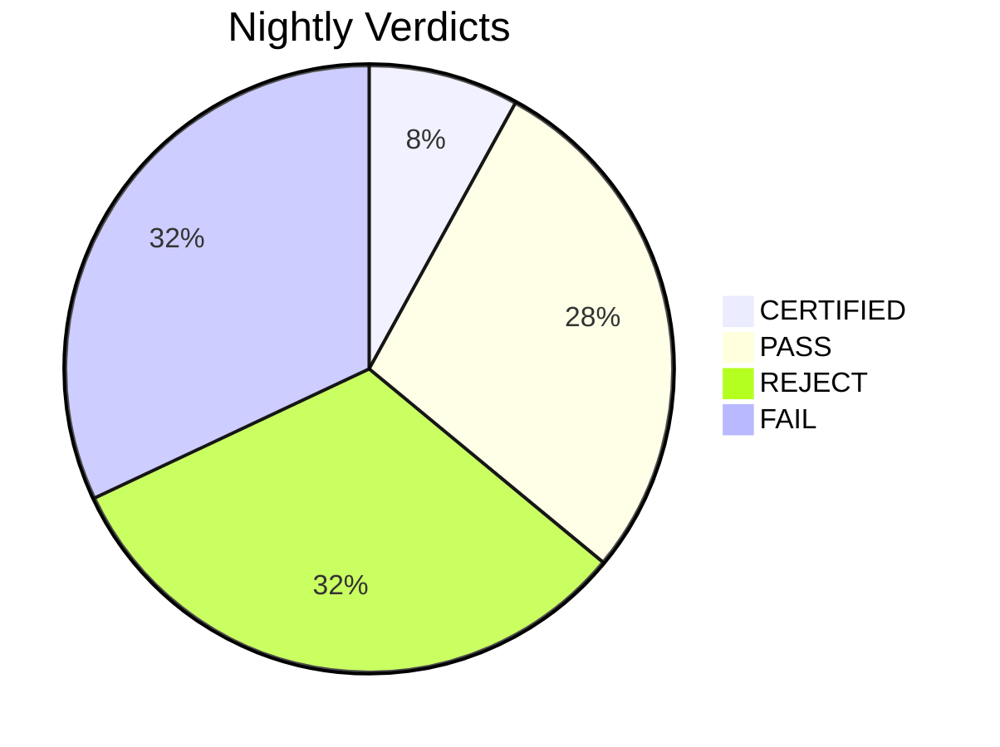

# Nightly Verification Report - 2026-04-08

**4/50 CERTIFIED** (0 cached) | 16 FAIL | 16 REJECT | 14 single-witness (PASS)

## Certified

| Project | Risk | Math | Witnesses | Bundle Hash | Time |
|---------|------|------|-----------|-------------|------|
| Meta_Ecosystem_Model | high | 7 | 2 | `10b92a8ba08116bc` | 16.2s |
| truthcert-openclaw-supermemory-stack | high | 2 | 2 | `509d6d291e93dc95` | 40.2s |
| ComponentNMA | medium_high | 7 | 2 | `05931881e24a8297` | 28.0s |
| ctgov-registry-survival | medium_high | 7 | 2 | `4bd49daa0b9d4d5a` | 30.2s |

## Single-Witness Pass

| Project | Risk | Math | Time |
|---------|------|------|------|
| esc-acs-living-meta | high | 20 | 4.1s |
| overmind | high | 20 | 14.1s |
| prognostic-meta | high | 20 | 8.2s |
| lec_phase0_project | high | 16 | 42.1s |
| rct-extractor-v2 | high | 15 | 24.2s |
| hfpef_registry_synth | high | 14 | 14.3s |
| BayesianMA | high | 13 | 30.2s |
| metasprint-dose-response | high | 12 | 20.2s |
| experimental-meta-analysis | high | 11 | 76.4s |
| cardio-ctgov-living-meta-portfolio | high | 10 | 8.3s |
| lec_phase0_bundle_backup_20260114_110427 | high | 10 | 20.9s |
| metasprint-cardio-universe | high | 9 | 4.2s |
| Denominator_Calibrated_Living_NMA | high | 8 | 6.2s |
| pub-bias-simulation | medium_high | 8 | 4.2s |

## Rejected (Witness Disagreement)

### advanced-nma-pooling
**Reason:** Witnesses disagree: test_suite, smoke PASS vs numerical FAIL

| Witness | Verdict | Details |
|---------|---------|---------|
| test_suite | PASS | .                                                                        [100%]  |
| smoke | PASS | 11 modules imported OK |
| numerical | FAIL | Failed to start: [WinError 2] The system cannot find the file specified |

### ipd-meta-pro-link
**Reason:** Witnesses disagree: test_suite PASS vs smoke FAIL

| Witness | Verdict | Details |
|---------|---------|---------|
| test_suite | PASS | ====================================================================== IPD Meta-Analysis Pro - Comprehensive Selenium Te |
| smoke | FAIL | dev.dedup_functions: This script is retired. dev/modules/ is the authoritative source. Edit the relevant module and run  |
| numerical | SKIP | No baseline file |

### ipd_qma_project
**Reason:** Witnesses disagree: test_suite PASS vs smoke FAIL

| Witness | Verdict | Details |
|---------|---------|---------|
| test_suite | PASS | ..........................................s.................             [100%] ============================== warnings  |
| smoke | FAIL | ipd_qma_bayesian: , in <module>     import ipd_qma_bayesian   File "C:\Projects\ipd_qma_project\ipd_qma_bayesian.py", li |
| numerical | SKIP | No baseline file |

### EvidenceOracle
**Reason:** Witnesses disagree: smoke PASS vs test_suite FAIL

| Witness | Verdict | Details |
|---------|---------|---------|
| test_suite | FAIL | s\user\AppData\Local\Programs\Python\Python313\Lib\site-packages\_pytest\main.py", line 365, in pytest_cmdline_main      |
| smoke | PASS | 2 modules imported OK |
| numerical | SKIP | No baseline file |

### repo300-ENMA-SNMA
**Reason:** Witnesses disagree: test_suite PASS vs smoke FAIL

| Witness | Verdict | Details |
|---------|---------|---------|
| test_suite | PASS | .                                                                        [100%] 1 passed in 0.20s  |
| smoke | FAIL | R.01_data_audit_and_fix: File "<string>", line 1     import R.01_data_audit_and_fix                ^ SyntaxError: invali |
| numerical | SKIP | No baseline file |

### asreview_5star
**Reason:** Witnesses disagree: smoke PASS vs test_suite FAIL

| Witness | Verdict | Details |
|---------|---------|---------|
| test_suite | FAIL | ci_upper=0.4807199058355748, se=0.136167516...ted': 0.6820000000000002, 'confusion_matrix': [[0.68, 0.17], [0.08, 0.07]] |
| smoke | PASS | 5 modules imported OK |
| numerical | SKIP | No baseline file |

### ubcma
**Reason:** Witnesses disagree: test_suite PASS vs smoke, numerical FAIL

| Witness | Verdict | Details |
|---------|---------|---------|
| test_suite | PASS | .......                                                                  [100%] 7 passed in 9.96s  |
| smoke | FAIL | examples.quickstart: io\common.py", line 873, in get_handle     handle = open(         handle,     ...<3 lines>...       |
| numerical | FAIL | Failed to start: [WinError 2] The system cannot find the file specified |

### llm-meta-analysis
**Reason:** Witnesses disagree: test_suite PASS vs smoke FAIL

| Witness | Verdict | Details |
|---------|---------|---------|
| test_suite | PASS | .                                                                        [100%]  |
| smoke | FAIL | evaluation.bayesian_meta_analysis: n_meta_analysis   File "C:\Projects\llm-meta-analysis\evaluation\bayesian_meta_analys |
| numerical | SKIP | No baseline file |

### registry_first_rct_meta
**Reason:** Witnesses disagree: smoke PASS vs test_suite FAIL

| Witness | Verdict | Details |
|---------|---------|---------|
| test_suite | FAIL |  =================================== ERRORS ==================================== _____________________ ERROR collecting  |
| smoke | PASS | 2 modules imported OK |
| numerical | SKIP | No baseline file |

### truthcert-denominator-phase1
**Reason:** Witnesses disagree: test_suite, smoke PASS vs numerical FAIL

| Witness | Verdict | Details |
|---------|---------|---------|
| test_suite | PASS | .                                                                        [100%] 1 passed in 4.17s  |
| smoke | PASS | 14 modules imported OK |
| numerical | FAIL | Failed to start: [WinError 2] The system cannot find the file specified |

### truthcert-meta2-prototype
**Reason:** Witnesses disagree: test_suite PASS vs smoke FAIL

| Witness | Verdict | Details |
|---------|---------|---------|
| test_suite | PASS | .                                                                        [100%] 1 passed in 4.69s  |
| smoke | FAIL | sim.run_suite: import timed out sim.score: import timed out sim.selection: import timed out |

### ctgov-search-strategies
**Reason:** Witnesses disagree: smoke PASS vs test_suite FAIL

| Witness | Verdict | Details |
|---------|---------|---------|
| test_suite | FAIL | ======================= short test summary info =========================== FAILED tests/test_strategy_optimizer.py::Tes |
| smoke | PASS | 20 modules imported OK |

### GWAM
**Reason:** Witnesses disagree: test_suite PASS vs smoke FAIL

| Witness | Verdict | Details |
|---------|---------|---------|
| test_suite | PASS | ...........                                                              [100%] 11 passed in 10.35s  |
| smoke | FAIL | scripts.build_pairwise70_ctgov_linkage_summary: els\GWAM\scripts\build_pairwise70_ctgov_linkage_summary.py", line 34, in |

### MetaAudit
**Reason:** Witnesses disagree: test_suite PASS vs smoke FAIL

| Witness | Verdict | Details |
|---------|---------|---------|
| test_suite | PASS | ============================= test session starts ============================= platform win32 -- Python 3.13.7, pytest- |
| smoke | FAIL | sensitivity_analysis: import timed out |

### hfpef_registry_calibration
**Reason:** Witnesses disagree: test_suite PASS vs smoke FAIL

| Witness | Verdict | Details |
|---------|---------|---------|
| test_suite | PASS | .                                                                        [100%] 1 passed in 1.47s  |
| smoke | FAIL | scripts.learn_gate:   File "C:\Projects\hfpef_registry_calibration\scripts\learn_gate.py", line 6, in <module>     from  |

### MetaRegression
**Reason:** Witnesses disagree: smoke PASS vs test_suite FAIL

| Witness | Verdict | Details |
|---------|---------|---------|
| test_suite | FAIL | s\user\AppData\Local\Programs\Python\Python313\Lib\site-packages\_pytest\main.py", line 365, in pytest_cmdline_main      |
| smoke | PASS | 1 modules imported OK |

## Failed (All Witnesses)

### CardioOracle
**Reason:** Hard timeout (300s) — process killed

**test_suite:** Project hung — killed after 300s

### idea12
**Reason:** All witnesses FAIL: test_suite, smoke

**test_suite:** 
=================================== ERRORS ====================================
____________________ ERROR collecting tests/test_basic.py _____________________
ImportError while importing test module 'C:\Projects\idea12\tests\test_basic.py'.
Hint: make sure your test modules/packages have valid Pyt
**smoke:** examples.complete_worked_example: ,encoding_table)[0]
           ~~~~~~~~~~~~~~~~~~~~~^^^^^^^^^^^^^^^^^^^^^^^^^^^^^^^^^^
UnicodeEncodeError: 'charmap' codec can't encode character '\u03c4' in position 31: character maps to <undefined>
examples.example_antidepressants: Projects\idea12\netmetareg\sele

### Dataextractor
**Reason:** All witnesses FAIL: test_suite, smoke

**test_suite:** Failed to start: [WinError 2] The system cannot find the file specified
**smoke:** expand_validation: ^^^^^^^^^^^^^^^^^^^^^^^^^^^^^^^^^^^^^^^^^^^^^^^^^^^^^^^^^^^^^^^^^^^^^^^^^
FileNotFoundError: [Errno 2] No such file or directory: 'C:\\Users\\user\\Downloads\\Dataextractor\\validation_independent.js'
selenium_simple_test: 
zs_compare: import timed out
python.setup: nalize_license

### evidence-inference
**Reason:** All witnesses FAIL: test_suite, smoke

**test_suite:** 
no tests ran in 0.02s

**smoke:** verify_span_quality: ntences, gen_exact_evid_array
  File "C:\Projects\evidence-inference\evidence_inference\preprocess\sentence_split.py", line 8, in <module>
    import spacy
ModuleNotFoundError: No module named 'spacy'
root_backup.add_2000_trials_batch19_38: ncoding='utf-8') as f:
         ~~~~^^

### Cbamm
**Reason:** Single witness: test_suite FAIL

**test_suite:** Failed to start: [WinError 2] The system cannot find the file specified

### DTA70
**Reason:** Single witness: test_suite FAIL

**test_suite:** Failed to start: [WinError 2] The system cannot find the file specified

### metasprintnma
**Reason:** All witnesses FAIL: test_suite, smoke

**test_suite:** Timed out after 120s
**smoke:** test_deep_integration: import timed out

### Dataextractor_backup_20260114_110706
**Reason:** Hard timeout (300s) — process killed

**test_suite:** Project hung — killed after 300s

### Pairwise70
**Reason:** All witnesses FAIL: test_suite, smoke

**test_suite:** ck, subtests, tmp_path, tmp_path_factory, tmpdir, tmpdir_factory, unused_tcp_port, unused_tcp_port_factory, unused_udp_port, unused_udp_port_factory
>       use 'pytest --fixtures [testpath]' for help on them.

C:\Users\user\OneDrive - NHS\Documents\Pairwise70\tests\selenium_comprehensive_test.py:75
**smoke:** truthcert.setup: usage: -c [global_opts] cmd1 [cmd1_opts] [cmd2 [cmd2_opts] ...]
   or: -c --help [cmd1 cmd2 ...]
   or: -c --help-commands
   or: -c cmd --help

error: no commands supplied

### rmstnma
**Reason:** Single witness: test_suite FAIL

**test_suite:** Failed to start: [WinError 2] The system cannot find the file specified

### FATIHA_Project
**Reason:** Single witness: test_suite FAIL

**test_suite:** Failed to start: [WinError 2] The system cannot find the file specified

### new-app
**Reason:** Single witness: test_suite FAIL

**test_suite:** Timed out after 120s

### NMA
**Reason:** Single witness: test_suite FAIL

**test_suite:** Failed to start: [WinError 2] The system cannot find the file specified

### GRMA_paper
**Reason:** All witnesses FAIL: test_suite, smoke

**test_suite:** Failed to start: [WinError 2] The system cannot find the file specified
**smoke:** dev_analyze_rmse_coverage:  encoding='utf-8') as f:
         ~~~~^^^^^^^^^^^^^^^^^^^^^^^^^^^^^^^^^^^^^^^^^
FileNotFoundError: [Errno 2] No such file or directory: 'C:\\Users\\user\\Downloads\\GRMA_paper\\Table_bias_rmse_v8.csv'
run_pairwise70_benchmark: n_pairwise70_benchmark.py", line 27, in <modul

### metaoverfit
**Reason:** Single witness: test_suite FAIL

**test_suite:** Failed to start: [WinError 2] The system cannot find the file specified

### MLMResearch
**Reason:** Single witness: test_suite FAIL

**test_suite:** Failed to start: [WinError 2] The system cannot find the file specified

Dream: 77 merges, 0 archives, 206->129 memories