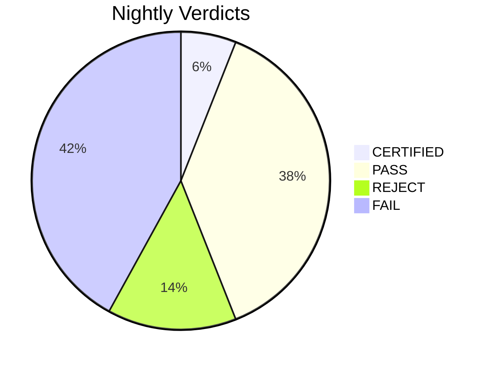

# Nightly Verification Report - 2026-04-09

**3/50 CERTIFIED** (0 cached) | 21 FAIL | 7 REJECT | 19 single-witness (PASS)

## Certified

| Project | Risk | Math | Witnesses | Bundle Hash | Time |
|---------|------|------|-----------|-------------|------|
| truthcert-meta2-prototype | high | 8 | 2 | `3d75da5bcc94329d` | 46.2s |
| ctgov-search-strategies_backup_20260114-110157 | high | 7 | 2 | `d029213e8e81711f` | 18.2s |
| Meta_Ecosystem_Model | high | 7 | 2 | `4b6be47026c08f00` | 18.4s |

## Single-Witness Pass

| Project | Risk | Math | Time |
|---------|------|------|------|
| advanced-nma-pooling | high | 20 | 10.2s |
| esc-acs-living-meta | high | 20 | 4.1s |
| ipd-meta-pro-link | high | 20 | 30.1s |
| overmind | high | 20 | 14.4s |
| prognostic-meta | high | 20 | 10.3s |
| metasprintnma | high | 17 | 138.3s |
| lec_phase0_project | high | 16 | 44.2s |
| rct-extractor-v2 | high | 15 | 22.2s |
| hfpef_registry_synth | high | 14 | 10.2s |
| BayesianMA | high | 13 | 28.2s |
| metasprint-dose-response | high | 12 | 18.2s |
| experimental-meta-analysis | high | 11 | 68.2s |
| moonshot-evidence-lab | high | 11 | 10.2s |
| Transcendent-Meta-Analysis-Lab | high | 11 | 59.7s |
| cardio-ctgov-living-meta-portfolio | high | 10 | 8.3s |
| truthcert-denominator-phase1 | high | 10 | 38.5s |
| Denominator_Calibrated_Living_NMA | high | 8 | 8.4s |
| GWAM | high | 7 | 16.1s |
| lec_phase0_bundle_backup_20260114_110427 | high | 7 | 12.1s |

## Rejected (Witness Disagreement)

### ipd_qma_project
**Reason:** Witnesses disagree: test_suite PASS vs smoke FAIL

| Witness | Verdict | Details |
|---------|---------|---------|
| test_suite | PASS | ..........................................s.................             [100%] ============================== warnings  |
| smoke | FAIL | ipd_qma_bayesian: , in <module>     import ipd_qma_bayesian   File "C:\Projects\ipd_qma_project\ipd_qma_bayesian.py", li |
| numerical | SKIP | No baseline file |

### EvidenceOracle
**Reason:** Witnesses disagree: smoke PASS vs test_suite FAIL

| Witness | Verdict | Details |
|---------|---------|---------|
| test_suite | FAIL | s\user\AppData\Local\Programs\Python\Python313\Lib\site-packages\_pytest\main.py", line 365, in pytest_cmdline_main      |
| smoke | PASS | 2 modules imported OK |
| numerical | SKIP | No baseline file |

### repo300-ENMA-SNMA
**Reason:** Witnesses disagree: test_suite PASS vs smoke FAIL

| Witness | Verdict | Details |
|---------|---------|---------|
| test_suite | PASS | .                                                                        [100%] 1 passed in 0.08s  |
| smoke | FAIL | R.01_data_audit_and_fix: File "<string>", line 1     import R.01_data_audit_and_fix                ^ SyntaxError: invali |
| numerical | SKIP | No baseline file |

### asreview_5star
**Reason:** Witnesses disagree: smoke PASS vs test_suite FAIL

| Witness | Verdict | Details |
|---------|---------|---------|
| test_suite | FAIL | ci_upper=0.4807199058355748, se=0.136167516...ted': 0.6820000000000002, 'confusion_matrix': [[0.68, 0.17], [0.08, 0.07]] |
| smoke | PASS | 5 modules imported OK |
| numerical | SKIP | No baseline file |

### ubcma
**Reason:** Witnesses disagree: test_suite PASS vs numerical FAIL

| Witness | Verdict | Details |
|---------|---------|---------|
| test_suite | PASS | .......                                                                  [100%] 7 passed in 6.49s  |
| smoke | SKIP | No modules to check |
| numerical | FAIL | Failed to start: [WinError 2] The system cannot find the file specified |

### llm-meta-analysis
**Reason:** Witnesses disagree: test_suite PASS vs smoke FAIL

| Witness | Verdict | Details |
|---------|---------|---------|
| test_suite | PASS | .                                                                        [100%]  |
| smoke | FAIL | evaluation.bayesian_meta_analysis: n_meta_analysis   File "C:\Projects\llm-meta-analysis\evaluation\bayesian_meta_analys |
| numerical | SKIP | No baseline file |

### ctgov-search-strategies
**Reason:** Witnesses disagree: smoke PASS vs test_suite FAIL

| Witness | Verdict | Details |
|---------|---------|---------|
| test_suite | FAIL | ======================== short test summary info =========================== FAILED tests/test_strategy_optimizer.py::Te |
| smoke | PASS | 20 modules imported OK |

## Failed (All Witnesses)

### CardioOracle
**Reason:** Hard timeout (300s) — process killed

**test_suite:** Project hung — killed after 300s

### Dataextractor_backup_20260114_110706
**Reason:** All witnesses FAIL: test_suite, smoke

**test_suite:** Failed to start: [WinError 2] The system cannot find the file specified
**smoke:** selenium_simple_test: 
zs_compare: import timed out

### idea12
**Reason:** All witnesses FAIL: test_suite, smoke

**test_suite:** 
=================================== ERRORS ====================================
____________________ ERROR collecting tests/test_basic.py _____________________
ImportError while importing test module 'C:\Projects\idea12\tests\test_basic.py'.
Hint: make sure your test modules/packages have valid Pyt
**smoke:** validation.benchmark_lu_ades_2004: Projects\idea12\netmetareg\selection\__init__.py", line 4, in <module>
    from .cross_validation import CrossValidationNMA
ModuleNotFoundError: No module named 'netmetareg.selection.cross_validation'
validation.run_quick_validation: Projects\idea12\netmetareg\sele

### metasprint-autopilot
**Reason:** Hard timeout (300s) — process killed

**test_suite:** Project hung — killed after 300s

### superapp
**Reason:** Hard timeout (300s) — process killed

**test_suite:** Project hung — killed after 300s

### Dataextractor
**Reason:** All witnesses FAIL: test_suite, smoke

**test_suite:** Failed to start: [WinError 2] The system cannot find the file specified
**smoke:** expand_validation: ^^^^^^^^^^^^^^^^^^^^^^^^^^^^^^^^^^^^^^^^^^^^^^^^^^^^^^^^^^^^^^^^^^^^^^^^^
FileNotFoundError: [Errno 2] No such file or directory: 'C:\\Users\\user\\Downloads\\Dataextractor\\validation_independent.js'
selenium_simple_test: 
zs_compare: import timed out
python.setup: nalize_license

### evidence-inference
**Reason:** All witnesses FAIL: test_suite, smoke

**test_suite:** 
no tests ran in 0.03s

**smoke:** verify_span_quality: ntences, gen_exact_evid_array
  File "C:\Projects\evidence-inference\evidence_inference\preprocess\sentence_split.py", line 8, in <module>
    import spacy
ModuleNotFoundError: No module named 'spacy'
root_backup.add_2000_trials_batch19_38: ncoding='utf-8') as f:
         ~~~~^^

### Cbamm
**Reason:** Single witness: test_suite FAIL

**test_suite:** Failed to start: [WinError 2] The system cannot find the file specified

### DTA70
**Reason:** Single witness: test_suite FAIL

**test_suite:** Failed to start: [WinError 2] The system cannot find the file specified

### Pairwise70
**Reason:** All witnesses FAIL: test_suite, smoke

**test_suite:** ck, subtests, tmp_path, tmp_path_factory, tmpdir, tmpdir_factory, unused_tcp_port, unused_tcp_port_factory, unused_udp_port, unused_udp_port_factory
>       use 'pytest --fixtures [testpath]' for help on them.

C:\Users\user\OneDrive - NHS\Documents\Pairwise70\tests\selenium_comprehensive_test.py:75
**smoke:** truthcert.setup: usage: -c [global_opts] cmd1 [cmd1_opts] [cmd2 [cmd2_opts] ...]
   or: -c --help [cmd1 cmd2 ...]
   or: -c --help-commands
   or: -c cmd --help

error: no commands supplied

### rmstnma
**Reason:** Single witness: test_suite FAIL

**test_suite:** Failed to start: [WinError 2] The system cannot find the file specified

### globalst
**Reason:** All witnesses FAIL: test_suite, smoke

**test_suite:**     def test_input_exists(self):
>       self.assertTrue(os.path.exists("globalst/data/cvd_synthesis_input.json"))
E       AssertionError: False is not true

tests\test_pipeline.py:12: AssertionError
___________________ TestGlobalSTPipeline.test_output_exists ___________________

self = <test_pipeli
**smoke:** src.model_stnma: import timed out

### FATIHA_Project
**Reason:** Single witness: test_suite FAIL

**test_suite:** Failed to start: [WinError 2] The system cannot find the file specified

### new-app
**Reason:** Single witness: test_suite FAIL

**test_suite:** Timed out after 120s

### NMA
**Reason:** Single witness: test_suite FAIL

**test_suite:** Failed to start: [WinError 2] The system cannot find the file specified

### HTA_Evidence_Integrity_Suite
**Reason:** Single witness: test_suite FAIL

**test_suite:** 
no tests ran in 2.35s

### lec_phase0_bundle
**Reason:** Hard timeout (300s) — process killed

**test_suite:** Project hung — killed after 300s

### registry_first_rct_meta
**Reason:** Single witness: test_suite FAIL

**test_suite:** 
=================================== ERRORS ====================================
_____________________ ERROR collecting tests/test_meta.py _____________________
ImportError while importing test module 'C:\Projects\registry_first_rct_meta\tests\test_meta.py'.
Hint: make sure your test modules/package

### metasprint-cardio-universe
**Reason:** Single witness: test_suite FAIL

**test_suite:** Failed to start: [WinError 2] The system cannot find the file specified

### metasprint-dta
**Reason:** Hard timeout (300s) — process killed

**test_suite:** Project hung — killed after 300s

### GRMA_paper
**Reason:** All witnesses FAIL: test_suite, smoke

**test_suite:** Failed to start: [WinError 2] The system cannot find the file specified
**smoke:** dev_analyze_rmse_coverage:  encoding='utf-8') as f:
         ~~~~^^^^^^^^^^^^^^^^^^^^^^^^^^^^^^^^^^^^^^^^^
FileNotFoundError: [Errno 2] No such file or directory: 'C:\\Users\\user\\Downloads\\GRMA_paper\\Table_bias_rmse_v8.csv'
run_pairwise70_benchmark: n_pairwise70_benchmark.py", line 27, in <modul

Dream: 35 merges, 0 archives, 206->171 memories