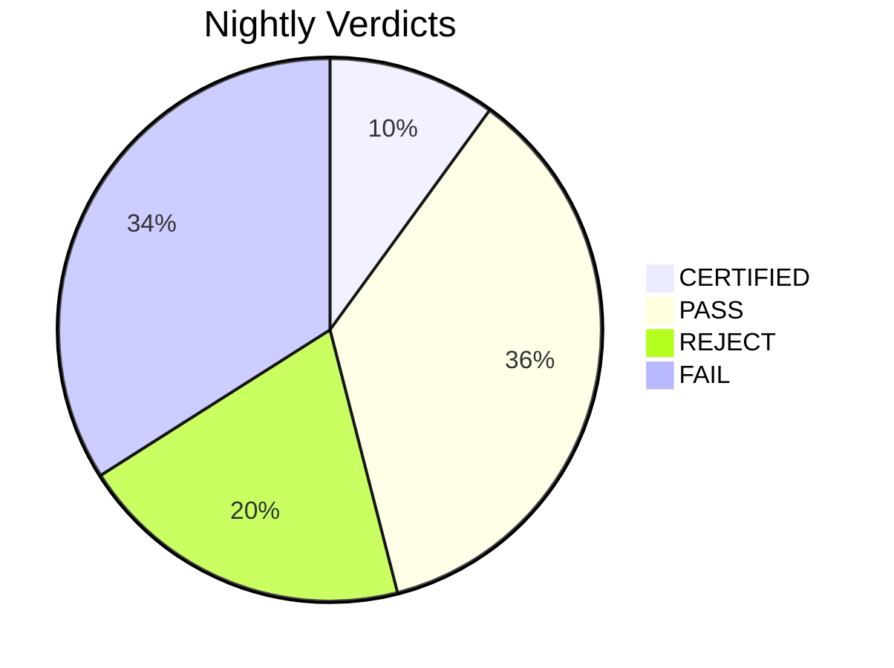

# Nightly Verification Report - 2026-04-13

**5/50 CERTIFIED** (0 cached) | 17 FAIL | 10 REJECT | 18 single-witness (PASS)

**Top proven fixes:**
- `TIMEOUT:advanced-n`: Check for WMI deadlock (Python 3.13), infinite loop, or slow (17% confidence)

## Certified

| Project | Risk | Math | Witnesses | Bundle Hash | Time |
|---------|------|------|-----------|-------------|------|
| truthcert-meta2-prototype | high | 8 | 2 | `2217619d50475acd` | 30.1s |
| ctgov-search-strategies | high | 7 | 2 | `43c90ae7a2559ddc` | 14.1s |
| meta-paradigm-shift | high | 5 | 2 | `c9c0684dd226435c` | 6.1s |
| four_limb_synthesis | high | 2 | 2 | `5c318522845c260a` | 12.1s |
| truthcert-openclaw-supermemory-stack | high | 2 | 2 | `23074671b33554ed` | 16.1s |

## Single-Witness Pass

| Project | Risk | Math | Time |
|---------|------|------|------|
| esc-acs-living-meta | high | 20 | 4.1s |
| overmind | high | 20 | 12.1s |
| lec_phase0_project | high | 16 | 18.1s |
| rct-extractor-v2 | high | 15 | 8.1s |
| EvidenceOracle | high | 14 | 6.1s |
| globalst | high | 14 | 8.1s |
| hfpef_registry_synth | high | 14 | 6.1s |
| BayesianMA | high | 13 | 22.1s |
| asreview_5star | high | 12 | 10.1s |
| experimental-meta-analysis | high | 11 | 30.1s |
| moonshot-evidence-lab | high | 11 | 4.1s |
| Transcendent-Meta-Analysis-Lab | high | 11 | 12.1s |
| cardio-ctgov-living-meta-portfolio | high | 10 | 2.1s |
| registry_first_rct_meta | high | 10 | 4.1s |
| metasprint-cardio-universe | high | 9 | 2.1s |
| Denominator_Calibrated_Living_NMA | high | 8 | 4.1s |
| GWAM | high | 7 | 12.1s |
| hfpef_registry_calibration | high | 6 | 4.1s |

## Rejected (Witness Disagreement)

### advanced-nma-pooling
**Reason:** Witnesses disagree: test_suite, smoke PASS vs numerical FAIL

| Witness | Verdict | Details |
|---------|---------|---------|
| test_suite | PASS | .                                                                        [100%]  |
| smoke | PASS | 10 modules imported OK |
| numerical | FAIL | Failed to start: [WinError 2] The system cannot find the file specified |

### CardioOracle
**Reason:** Witnesses disagree: test_suite PASS vs smoke FAIL

| Witness | Verdict | Details |
|---------|---------|---------|
| test_suite | PASS | ..............................                                           [100%] 30 passed in 6.35s  |
| smoke | FAIL | debug_test: Verifier [0x2eee9a+2baa] 	KERNEL32!BaseThreadInitThunk [0x75d85d49+19] 	ntdll!RtlInitializeExceptionChain [0 |
| numerical | SKIP | No baseline file |

### idea12
**Reason:** Witnesses disagree: test_suite PASS vs smoke FAIL

| Witness | Verdict | Details |
|---------|---------|---------|
| test_suite | PASS | ...............                                                          [100%] ============================== warnings  |
| smoke | FAIL | validation.run_quick_validation: ams\Python\Python313\Lib\site-packages\pandas\core\apply.py", line 663, in normalize_di |
| numerical | SKIP | No baseline file |

### ipd_qma_project
**Reason:** Witnesses disagree: test_suite PASS vs smoke FAIL

| Witness | Verdict | Details |
|---------|---------|---------|
| test_suite | PASS | ..........................................s.................             [100%] ============================== warnings  |
| smoke | FAIL | ipd_qma_ml: ost recent call last):   File "<string>", line 1, in <module>     import ipd_qma_ml   File "C:\Projects\ipd_ |
| numerical | SKIP | No baseline file |

### repo300-ENMA-SNMA
**Reason:** Witnesses disagree: test_suite PASS vs smoke FAIL

| Witness | Verdict | Details |
|---------|---------|---------|
| test_suite | PASS | .                                                                        [100%] 1 passed in 0.02s  |
| smoke | FAIL | R.01_data_audit_and_fix: File "<string>", line 1     import R.01_data_audit_and_fix                ^ SyntaxError: invali |
| numerical | SKIP | No baseline file |

### ubcma
**Reason:** Witnesses disagree: test_suite PASS vs numerical FAIL

| Witness | Verdict | Details |
|---------|---------|---------|
| test_suite | PASS | .......                                                                  [100%] 7 passed in 1.95s  |
| smoke | SKIP | No modules to check |
| numerical | FAIL | Failed to start: [WinError 2] The system cannot find the file specified |

### llm-meta-analysis
**Reason:** Witnesses disagree: test_suite PASS vs smoke FAIL

| Witness | Verdict | Details |
|---------|---------|---------|
| test_suite | PASS | .                                                                        [100%]  |
| smoke | FAIL | evaluation.bayesian_meta_analysis: n_meta_analysis   File "C:\Projects\llm-meta-analysis\evaluation\bayesian_meta_analys |
| numerical | SKIP | No baseline file |

### truthcert-denominator-phase1
**Reason:** Witnesses disagree: test_suite, smoke PASS vs numerical FAIL

| Witness | Verdict | Details |
|---------|---------|---------|
| test_suite | PASS | .                                                                        [100%] 1 passed in 2.57s  |
| smoke | PASS | 14 modules imported OK |
| numerical | FAIL | Failed to start: [WinError 2] The system cannot find the file specified |

### MetaAudit
**Reason:** Witnesses disagree: test_suite PASS vs smoke FAIL

| Witness | Verdict | Details |
|---------|---------|---------|
| test_suite | PASS | ============================= test session starts ============================= platform win32 -- Python 3.13.7, pytest- |
| smoke | FAIL | sensitivity_analysis: import timed out |

### MetaRegression
**Reason:** Witnesses disagree: smoke PASS vs test_suite FAIL

| Witness | Verdict | Details |
|---------|---------|---------|
| test_suite | FAIL |      	chromedriver!GetHandleVerifier [0x7ff7edd7facc+3a88c] E       	chromedriver!GetHandleVerifier [0x7ff7edd63634+1e3f |
| smoke | PASS | 1 modules imported OK |

## Failed (All Witnesses)

### ipd-meta-pro-link
**Reason:** Single witness: test_suite FAIL

**test_suite:** python: can't open file 'C:\\Projects\\ipd-meta-pro-link\\dev\\build-scripts\\user_flow_smoke_test.py': [Errno 2] No such file or directory

### prognostic-meta
**Reason:** Single witness: test_suite FAIL

**test_suite:** Failed to start: [WinError 267] The directory name is invalid

### Dataextractor
**Reason:** All witnesses FAIL: test_suite, smoke

**test_suite:** Failed to start: [WinError 2] The system cannot find the file specified
**smoke:** expand_validation: ^^^^^^^^^^^^^^^^^^^^^^^^^^^^^^^^^^^^^^^^^^^^^^^^^^^^^^^^^^^^^^^^^^^^^^^^^
FileNotFoundError: [Errno 2] No such file or directory: 'C:\\Users\\user\\Downloads\\Dataextractor\\validation_independent.js'
selenium_simple_test: 
zs_compare: import timed out
python.setup: nalize_license

### evidence-inference
**Reason:** All witnesses FAIL: test_suite, smoke

**test_suite:** 
no tests ran in 0.01s

**smoke:** verify_span_quality: ntences, gen_exact_evid_array
  File "C:\Projects\evidence-inference\evidence_inference\preprocess\sentence_split.py", line 8, in <module>
    import spacy
ModuleNotFoundError: No module named 'spacy'
root_backup.add_2000_trials_batch19_38: ncoding='utf-8') as f:
         ~~~~^^

### Cbamm
**Reason:** Single witness: test_suite FAIL

**test_suite:** Failed to start: [WinError 2] The system cannot find the file specified

### DTA70
**Reason:** Single witness: test_suite FAIL

**test_suite:** Failed to start: [WinError 2] The system cannot find the file specified

### metasprintnma
**Reason:** Single witness: test_suite FAIL

**test_suite:** Failed to start: [WinError 267] The directory name is invalid

### Pairwise70
**Reason:** All witnesses FAIL: test_suite, smoke

**test_suite:** Timed out after 120s
**smoke:** truthcert.setup: usage: -c [global_opts] cmd1 [cmd1_opts] [cmd2 [cmd2_opts] ...]
   or: -c --help [cmd1 cmd2 ...]
   or: -c --help-commands
   or: -c cmd --help

error: no commands supplied

### rmstnma
**Reason:** Single witness: test_suite FAIL

**test_suite:** Failed to start: [WinError 2] The system cannot find the file specified

### metasprint-dose-response
**Reason:** Single witness: test_suite FAIL

**test_suite:** Failed to start: [WinError 267] The directory name is invalid

### FATIHA_Project
**Reason:** Single witness: test_suite FAIL

**test_suite:** Failed to start: [WinError 2] The system cannot find the file specified

### new-app
**Reason:** Single witness: test_suite FAIL

**test_suite:** Timed out after 120s

### NMA
**Reason:** Single witness: test_suite FAIL

**test_suite:** Failed to start: [WinError 2] The system cannot find the file specified

### GRMA_paper
**Reason:** Single witness: test_suite FAIL

**test_suite:** Failed to start: [WinError 2] The system cannot find the file specified

### Meta_Ecosystem_Model
**Reason:** Single witness: test_suite FAIL

**test_suite:** Failed to start: [WinError 267] The directory name is invalid

### metaoverfit
**Reason:** Single witness: test_suite FAIL

**test_suite:** Failed to start: [WinError 2] The system cannot find the file specified

### MLMResearch
**Reason:** Single witness: test_suite FAIL

**test_suite:** Failed to start: [WinError 2] The system cannot find the file specified

Dream: 82 merges, 0 archives, 281->199 memories